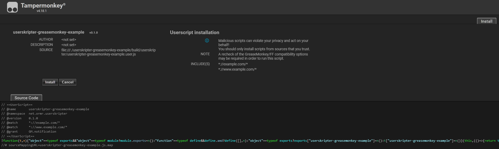

= Userskripter GreaseMonkey Example

This project is an example/template repository for how to use https://github.com/userskripter/userskripter[userskripter] to create userscripts for the https://wiki.greasespot.net/Main_Page[GreaseMonkey] script engine.

It's recommended, if possible, to use https://www.tampermonkey.net/[TamperMonkey] instead of GreaseMonkey, as TamperMonkey is more frequently maintained, has better security, and offers more utility functions for developing userscripts. With the "blocking" api available in TamperMonkey it's also possible to generate much smaller code bundles, 9 kB vs 91 kB for the same program, explained more thoroughly in the TamperMonkey example repository. To see an example of how to build TamperMonkey userscripts with userskripter, checkout the https://github.com/userskripter/userskripter-tampermonkey-example[userskripter-tampermonkey-example] repository.

== Installation

To generate and access the required `*.user.js` file there's two ways:

'''

=== `generateUserscript`

[source,bash]
----
/.gradlew :generateUserscript
----

And then navigate to the `./build/userskripter/` directory, where you'll see the `userskripter-greasemonkey-example.user.js` file.

`generateUserscript` is a task provided by default as long as you use the userskripter gradle plugin.

=== `openUserscriptDirectory`

[source,bash]
----
/.gradlew :openUserscriptDirectory
----

If nothing goes wrong then the `./build/userskripter/` directory should be opened when the task finishes executing, inside that directory there should be a `userskripter-greasemonkey-example.user.js` file.

`openUserscriptDirectory` is a custom task defined inside the `build.gradle.kts` file, it depends on the `generateUserscript` task.

'''

If using TamperMonkey _(recommended)_ then all that's needed to install the generated script file is to drag and drop the `userskripter-greasemonkey-example.user.js` file onto a new empty tab in your web browser, which should bring up this page after a second or two:

Just click on the `Install` button and then navigate to https://xxx[example.com] where there should now be a `button` element under the `More Information...` text with the text `Click Me!`. Clicking on the button should bring up a new notification with the title `userskripter-greasemonkey-example` and the text `This is a notification!`.

If you're using GreaseMonkey, then you're own your own.